---
## Front matter
title: "Отчёт по лабораторной работе №2"
subtitle: "Дисциплина: Архитектура компьютеров"
author: "Филипьева Ксения Дмитриевна"

## Generic otions
lang: ru-RU
toc-title: "Содержание"

## Bibliography
bibliography: bib/cite.bib
csl: pandoc/csl/gost-r-7-0-5-2008-numeric.csl

## Pdf output format
toc: true # Table of contents
toc-depth: 2
lof: true # List of figures
fontsize: 12pt
linestretch: 1.5
papersize: a4
documentclass: scrreprt
## I18n polyglossia
polyglossia-lang:
  name: russian
  options:
	- spelling=modern
	- babelshorthands=true
polyglossia-otherlangs:
  name: english
## I18n babel
babel-lang: russian
babel-otherlangs: english
## Fonts
mainfont: PT Serif
romanfont: PT Serif
sansfont: PT Sans
monofont: PT Mono
mainfontoptions: Ligatures=TeX
romanfontoptions: Ligatures=TeX
sansfontoptions: Ligatures=TeX,Scale=MatchLowercase
monofontoptions: Scale=MatchLowercase,Scale=0.9
## Biblatex
biblatex: true
biblio-style: "gost-numeric"
biblatexoptions:
  - parentracker=true
  - backend=biber
  - hyperref=auto
  - language=auto
  - autolang=other*
  - citestyle=gost-numeric
## Pandoc-crossref LaTeX customization
figureTitle: "Рис."
tableTitle: "Таблица"
listingTitle: "Листинг"
lofTitle: "Список иллюстраций"
lolTitle: "Листинги"
## Misc options
indent: true
header-includes:
  - \usepackage{indentfirst}
  - \usepackage{float} # keep figures where there are in the text
  - \floatplacement{figure}{H} # keep figures where there are in the text
---

# Цель работы

Целью данной работы является изучить идеологию и применение средств контроля версий, а также освоить умения по работе с github.

# Задание

1. Настройка github
2. Базовая настройка git
3. Создание SSH ключа
4. Создание рабочего пространства и репозитория курса на основе шаблона
5. Создание репозитория курса на основе шаблона
6. Настройка каталога курса
7. Задание для самостоятельной работы

# Теоретическое введение

  Системы контроля версий (Version Control System, VCS) применяются при
работе нескольких человек над одним проектом. Обычно основное дерево проекта
хранится в локальном или удалённом репозитории, к которому настроен доступ для
участников проекта. При внесении изменений в содержание проекта система
контроля версий позволяет их фиксировать, совмещать изменения, произведённые
разными участниками проекта, производить откат к любой более ранней версии
проекта, если это требуется. В классических системах контроля версий
используется централизованная модель, предполагающая наличие единого
репозитория для хранения файлов. Выполнение большинства функций по
управлению версиями осуществляется специальным сервером. Участник проекта
(пользователь) перед началом работы посредством определённых команд получает
нужную ему версию файлов. После внесения изменений, пользователь размещает
новую версию в хранилище. При этом предыдущие версии не удаляются из
центрального хранилища и к ним можно вернуться в любой момент. Сервер может
сохранять не полную версию изменённых файлов, а производить так называемую
дельта-компрессию — сохранять только изменения между последовательными
версиями, что позволяет уменьшить объём хранимых данных. Системы контроля
версий поддерживают возможность отслеживания и разрешения конфликтов,
которые могут возникнуть при работе нескольких человек над одним файлом.
Можно объединить (слить) изменения, сделанные разными участниками
(автоматически или вручную), вручную выбрать нужную версию, отменить
изменения вовсе или заблокировать файлы для изменения. Системы контроля
версий также могут обеспечивать дополнительные, более гибкие функциональные
возможности. Например, они могут поддерживать работу с несколькими версиями
одного файла, сохраняя общую историю изменений до точки ветвления версий и
собственные истории изменений каждой ветви. В отличие от классических, в
распределённых системах контроля версий центральный репозиторий не является
обязательным. Среди классических VCS наиболее известны CVS, Subversion, а
среди распределённых — Git, Bazaar, Mercurial. Принципы их работы схожи,
отличаются они в основном синтаксисом используемых в работе команд.
  Система контроля версий Git представляет собой набор программ командной
строки. Доступ к ним можно получить из терминала посредством ввода команды git
с различными опциями. Благодаря тому, что Git является распределённой системой
контроля версий, резервную копию локального хранилища можно сделать простым
копированием или архивацией.

# Выполнение лабораторной работы

Настройка GitHub
 
  Поскольку учетная запись на Github уже имеется, регистрировать ее нет
необходимости.

Базовая настройка git
  Откроем терминал и введем следующие команды с указанием имени и фамилии, а
также нашей электронной почты. (рис. @fig:1)

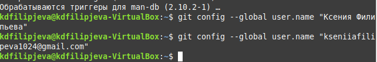{#fig:1 width=100%}

  Настроим вывод utf-8 в выводе сообщений git.Так же зададим имя начальной
ветки – «master». (рис. @fig:2)

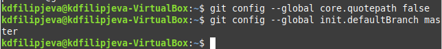{#fig:2 width=100%}
  
  Так же подключим параметры «autocrlf» и «safecrlf».(рис. @fig:3)
  
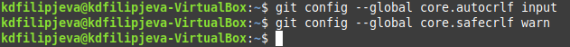{#fig:3 width=100%}

# Cоздание SSH ключа

  Для последующей идентификации пользователя на сервере репозиториев
необходимо сгенерировать пару ключей (приватный и открытый). Для этого
используем команду «ssh-keygen». (рис. @fig:4). После генерации ключ сохраняется
в каталоге ~/.ssh/.
 
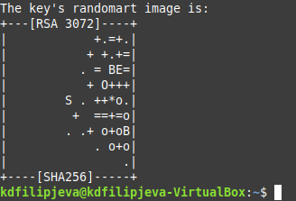{#fig:4 width=100%}

  Скопируем получившийся ключ с помощью команды «cat» и загрузим его в наш
аккаунт Github, указав имя для этого ключа.(рис. @fig:5)(рис. @fig:6)

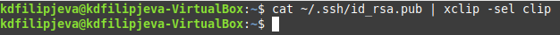{#fig:5 width=100%}

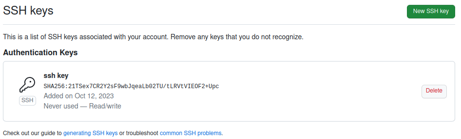{#fig:6 width=100%}

# Создание рабочего пространства и репозитория курса на основе шаблона
  
    
    При выполнении лабораторных работ следует соблюдать определенную
иерархию, которая у нас и соблюдается. Создадим каталог для предмета
«Архитектура компьютера» с помощью терминала.(рис. @fig:7)

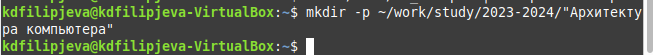{#fig:7 width=100%}
  
Создание репозитория курса на основе шаблона
  
    Перейдя на страницу с шаблоном курса (https://github.com/yamadharma/course-directory-student-template) 
создадим репозиторий и присвоим ему имя. (рис. @fig:8)

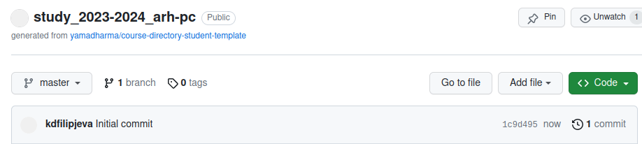{#fig:8 width=100%}

    Используя терминал перейдем к каталогу курса. Клонируем данный репозиторий используя команду «git clone --recursive»
предварительно скопировав ссылку для клонирования в нашем личном кабинете
за счет SSH-ключа.(рис. @fig:9)

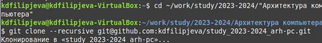{#fig:9 width=100%}
 
# Настройка каталога курса

    Перейдем в каталог курса используя команду «cd» и удалим файл
«package.json» используя команду «rm».(рис. @fig:10)

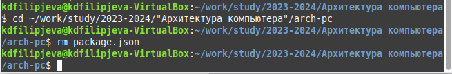{#fig:10 width=100%}

    Создаем необходимые нам каталоги в репозитории используя команду «echo»
и «make». (рис. @fig:11).

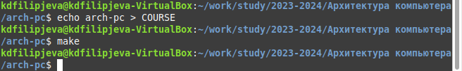{#fig:11 width=100%}
    

    После всех проделанных действий отправляем файлы на сервер используя
череду команд «git add», «git commit» и «git push». (рис. @fig:12, рис. @fig:13).

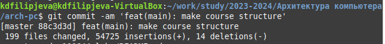{#fig:12 width=100%}

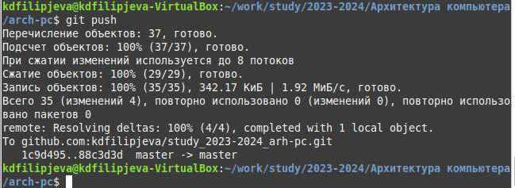{#fig:13 width=100%}
  
# Выполнение заданий для самостоятельной работы.
 
    
    Отчет по проведенной лабораторной работе создан и загружен в
(labs>lab02>report). (рис. @fig:14). Так же предыдущая лабораторная работа была
загружена в (labs>lab01>report). (рис. @fig:15).

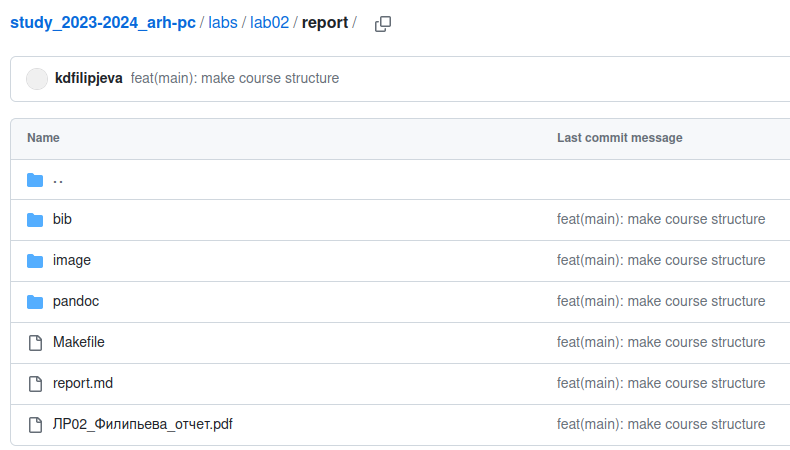{#fig:14 width=100%}

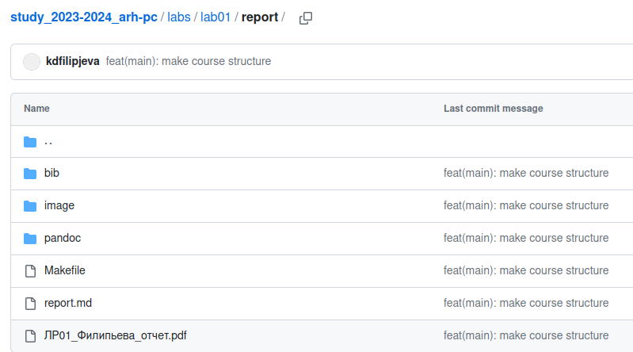{#fig:15 width=100%}
  
# Выводы

В ходе лабораторной работы я изучила идеологию и приминение средств
контроля версий и приобрела практические навыки по раборте с системой git.
