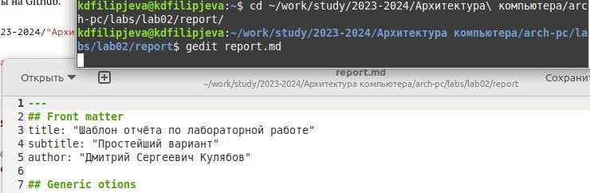

---
## Front matter
title: "Отчёт по лабораторной работе №3"
subtitle: "Дисциплина: Архитектура компьютеров"
author: "Филипьева Ксения Дмитриевна"

## Generic otions
lang: ru-RU
toc-title: "Содержание"

## Bibliography
bibliography: bib/cite.bib
csl: pandoc/csl/gost-r-7-0-5-2008-numeric.csl

## Pdf output format
toc: true # Table of contents
toc-depth: 2
lof: true # List of figures
fontsize: 12pt
linestretch: 1.5
papersize: a4
documentclass: scrreprt
## I18n polyglossia
polyglossia-lang:
  name: russian
  options:
    - spelling=modern
    - babelshorthands=true
polyglossia-otherlangs:
  name: english
## I18n babel
babel-lang: russian
babel-otherlangs: english
## Fonts
mainfont: PT Serif
romanfont: PT Serif
sansfont: PT Sans
monofont: PT Mono
mainfontoptions: Ligatures=TeX
romanfontoptions: Ligatures=TeX
sansfontoptions: Ligatures=TeX,Scale=MatchLowercase
monofontoptions: Scale=MatchLowercase,Scale=0.9
## Biblatex
biblatex: true
biblio-style: "gost-numeric"
biblatexoptions:
  - parentracker=true
  - backend=biber
  - hyperref=auto
  - language=auto
  - autolang=other*
  - citestyle=gost-numeric
## Pandoc-crossref LaTeX customization
figureTitle: "Рис."
tableTitle: "Таблица"
listingTitle: "Листинг"
lofTitle: "Список иллюстраций"
lolTitle: "Листинги"
## Misc options
indent: true
header-includes:
  - \usepackage{indentfirst}
  - \usepackage{float} # keep figures where there are in the text
  - \floatplacement{figure}{H} # keep figures where there are in the text
---

# Цель работы

Целью работы является освоение процедуры оформления отчетов с помощью легковесного
языка разметки Markdown.

# Задание

1. Установка необходимого ПО
2. Заполнение отчета по выполнению лабораторной работы №3 с помощью языка разметки Markdown
3. Выполнение заданий для самостоятельной работы

# Теоретическое введение

Markdown - легковесный язык разметки, созданный с целью обозначения форматирования в простом тексте, 
с максимальным сохранением его читаемости. Markdown поддерживает как встраивание фрагментов кода в 
предложение, так и их размещение между предложениями в виде отдельных огражденных блоков. Огражденные блоки
кода — это простой способ выделить синтаксис для фрагментов кода. Внутритекстовые формулы делаются аналогично 
формулам LaTeX. В Markdown вставить изображение в документ можно с помощью непосредственного указания адреса 
изображения

# Выполнение лабораторной работы

  Открываем терминал, переходим в каталог курса, сформированный при выполненнии прошлой лаборатной работы, а так же обновляем локальный репозиторий. (рис. @fig:1)

{#fig:1 width=100%}

  Переходим в каталог с шаблоном отчета по лабораторной работе №3 и компилируем шаблон с использованием Makefile, введя команду make. После проверим корректность ее выполнения. (рис. @fig:2)
  
{#fig:2 width=90%}
  
  Команда была выполнена корректно. Удаляем полученные файлы с использованием Makefile, введя команду make clean. (рис. @fig:3)
  
{#fig:3 width=100%}
 
  Открываем файл report.md, используя gedit и изучаем его (рис. @fig:4)
  
{#fig:4 width=100%}
 
  Заполняем отчет с помощью разметки Markdown.

# Выполнение самостоятельной работы
  
  1. Переходим в директорию lab02/report с помощью cd, чтобы заполнить отчет по второй лабораторной работе. Откроем файл используя команду gedit и приступим к заполнению отчета. (рис. @fig:5)
  
{#fig:5 width=100%}
  
  2. Отправляем оба отчета на github (рис. @fig:7).
 
{#fig:7 width=70%} 
 
 
# Выводы

В ходе лабораторной работы мы освоили процедуры оформления отчетов с помощью легковесного языка разметки Markdown
