---
## Front matter
title: "Отчёт по лабораторной работе №4"
subtitle: "Дисциплина: Архитектура компьютеров"
author: "Филипьева Ксения Дмитриевна"

## Generic otions
lang: ru-RU
toc-title: "Содержание"

## Bibliography
bibliography: bib/cite.bib
csl: pandoc/csl/gost-r-7-0-5-2008-numeric.csl

## Pdf output format
toc: true # Table of contents
toc-depth: 2
lof: true # List of figures
fontsize: 12pt
linestretch: 1.5
papersize: a4
documentclass: scrreprt
## I18n polyglossia
polyglossia-lang:
  name: russian
  options:
	- spelling=modern
	- babelshorthands=true
polyglossia-otherlangs:
  name: english
## I18n babel
babel-lang: russian
babel-otherlangs: english
## Fonts
mainfont: PT Serif
romanfont: PT Serif
sansfont: PT Sans
monofont: PT Mono
mainfontoptions: Ligatures=TeX
romanfontoptions: Ligatures=TeX
sansfontoptions: Ligatures=TeX,Scale=MatchLowercase
monofontoptions: Scale=MatchLowercase,Scale=0.9
## Biblatex
biblatex: true
biblio-style: "gost-numeric"
biblatexoptions:
  - parentracker=true
  - backend=biber
  - hyperref=auto
  - language=auto
  - autolang=other*
  - citestyle=gost-numeric
## Pandoc-crossref LaTeX customization
figureTitle: "Рис."
tableTitle: "Таблица"
listingTitle: "Листинг"
lofTitle: "Список иллюстраций"
lolTitle: "Листинги"
## Misc options
indent: true
header-includes:
  - \usepackage{indentfirst}
  - \usepackage{float} # keep figures where there are in the text
  - \floatplacement{figure}{H} # keep figures where there are in the text
---

# Цель работы

Целью работы является освоение процедуры компиляции и сборки программ, написанных на ассемблере NASM.

# Задание

1. Выполнение лабораторной работы №4
2. Заполнение отчета по выполнению лабораторной работы №4 с помощью языка разметки Markdown
3. Выполнение заданий для самостоятельной работы

# Теоретическое введение

Язык ассемблера (assembly language, сокращённо asm) — машинно-ориентированный
язык низкого уровня. Можно считать, что он больше любых других языков приближен к
архитектуре ЭВМ и её аппаратным возможностям, что позволяет получить к ним более
полный доступ, нежели в языках высокого уровня, таких как C/C++, Perl, Python и пр.

# Выполнение лабораторной работы

  Открываем терминал, создаем папку "lab04" в папке "work" для работы с программами на языке ассемблера NASM и переходим в нее. (рис. @fig:1)

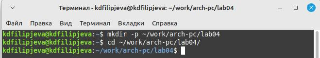{#fig:1 width=100%}

  После того, как перешли в созданный нами каталог, создадим файл "hello.asm" и откроем его с помощью текстового редактора "gedit" (рис. @fig:2)
  
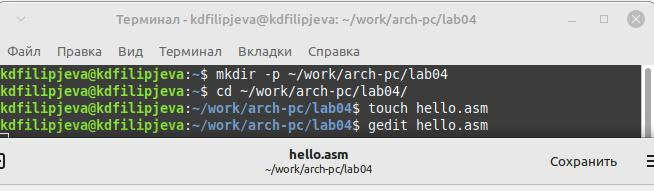{#fig:2 width=100%}
  
  После того, как файл был открыт с помощью текстового редактора, вставим в него заранее заготовленный текст на языке ассемблера. (рис. @fig:3)
  
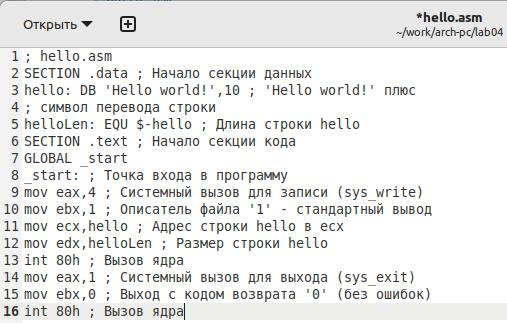{#fig:3 width=100%}

  В отличие от многих современных высокоуровневых языков программирования, в ассемблерной программе каждая команда распологается на отдельной строке. Так же синтаксис чувствителем к регистру.

 
  С помощью команды "nasm" скомпилируем текст программы "Hello world". Текст был вставлен без ошибок, поэтому после, при проверке через "ls", у нас появился необходимый файл - "hello.o" (рис. @fig:4)
  
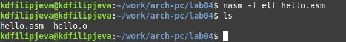{#fig:4 width=100%}
 
  После введем полный вариант команды "nasm", который скомпилирует нашу программу в файл "obj.o". После выполнения проверим правильность выполнения с помощью команды "ls". (рис. @fig:5)

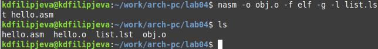{#fig:5 width=100%}

  Теперь передаем исполняемую программу на обработку компановщику, используя команду "ld". Проверив выполнение с помощью команды "ls" необходимый нам исполняемый файл "hello". (рис. @fig:6)

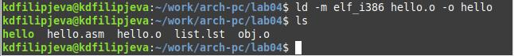{#fig:6 width=100%}

  Опять используем компановщика, чтобы задать имя создаваемого исполняемого файла. Проверяем правильность выполнения. (рис. @fig:7)

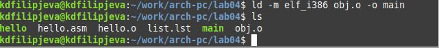{#fig:7 width=100%}

  Выполним созданный нами исполняемый файл с помощью команды "./hello" (рис. @fig:8)

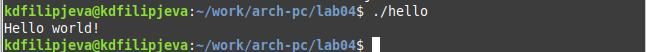{#fig:8 width=100%}

# Выполнение самостоятельной работы
  
  1. Переходим в каталог ~/work/arch-pc/lab04 с помощью "cd", после с помощью команды "cp" создаем копию файла "hello.asm" с именем "lab4.asm" (рис. @fig:9)
  
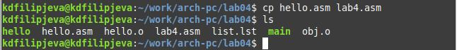{#fig:9 width=100%}
  
  2. С помощью текстового редактора gedit внесем изменения в текст программы так, чтобы вместо фразы "hello world" выводились мои имя и фамилия. После конвертируем полученный текст в файле "lab4.asm" в объектный файл, выполним компановку и запустим получившийся исполняемый файл (рис. @fig:10)

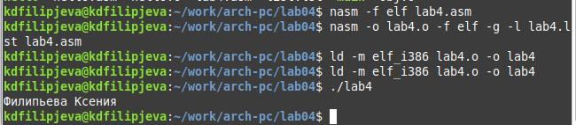{#fig:10 width=100%} 

  3. Скопируем все файлы в локальный репозиторий и выгрузим на Github (рис. @fig:11)

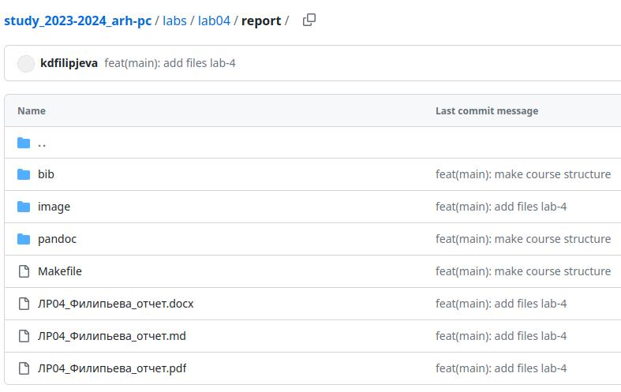{#fig:11 width=100%} 
 
# Выводы

В ходе лабораторной работы мы освоили процедуры компиляции и сборки программ на языке ассемблера.
