---
## Front matter
title: "Отчёт по лабораторной работе №5"
subtitle: "Дисциплина: Архитектура компьютеров"
author: "Филипьева Ксения Дмитриевна"

## Generic otions
lang: ru-RU
toc-title: "Содержание"

## Bibliography
bibliography: bib/cite.bib
csl: pandoc/csl/gost-r-7-0-5-2008-numeric.csl

## Pdf output format
toc: true # Table of contents
toc-depth: 2
lof: true # List of figures
fontsize: 12pt
linestretch: 1.5
papersize: a4
documentclass: scrreprt
## I18n polyglossia
polyglossia-lang:
  name: russian
  options:
	- spelling=modern
	- babelshorthands=true
polyglossia-otherlangs:
  name: english
## I18n babel
babel-lang: russian
babel-otherlangs: english
## Fonts
mainfont: PT Serif
romanfont: PT Serif
sansfont: PT Sans
monofont: PT Mono
mainfontoptions: Ligatures=TeX
romanfontoptions: Ligatures=TeX
sansfontoptions: Ligatures=TeX,Scale=MatchLowercase
monofontoptions: Scale=MatchLowercase,Scale=0.9
## Biblatex
biblatex: true
biblio-style: "gost-numeric"
biblatexoptions:
  - parentracker=true
  - backend=biber
  - hyperref=auto
  - language=auto
  - autolang=other*
  - citestyle=gost-numeric
## Pandoc-crossref LaTeX customization
figureTitle: "Рис."
tableTitle: "Таблица"
listingTitle: "Листинг"
lofTitle: "Список иллюстраций"
lolTitle: "Листинги"
## Misc options
indent: true
header-includes:
  - \usepackage{indentfirst}
  - \usepackage{float} # keep figures where there are in the text
  - \floatplacement{figure}{H} # keep figures where there are in the text
---

# Цель работы

Приобретение практических навыков работы в Midnight Commander. Освоение инструкций
языка ассемблера mov и int.

# Задание

1. Выполнение лабораторной работы №5
2. Заполнение отчета по выполнению лабораторной работы №5 с помощью языка разметки Markdown
3. Выполнение заданий для самостоятельной работы

# Теоретическое введение

Midnight Commander (или просто mc) — это программа, которая позволяет просматривать
структуру каталогов и выполнять основные операции по управлению файловой системой,
т.е. mc является файловым менеджером. Midnight Commander позволяет сделать работу с
файлами более удобной и наглядной.

# Выполнение лабораторной работы

  Открываем терминал, запускаем файловый менеджер Midnight Commander с помощью команды "mc". (рис. @fig:1)

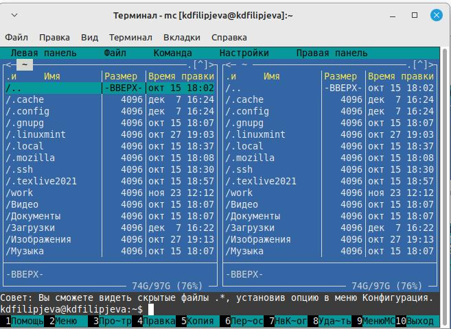{#fig:1 width=100%}

  После того, как открыли МС, переходим в каталог, созданный в ходе прошлой ЛР и создаем папку "lab05" используя клавишу F7. (рис. @fig:2)
  
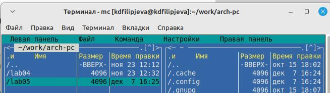{#fig:2 width=100%}
  
  После того, как папка была создана, создадим в ней файл "lab5-1.asm".  (рис. @fig:3)
  
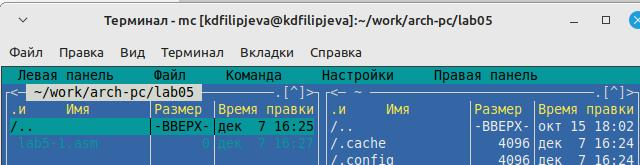{#fig:3 width=100%}
 
  С помощью клавиши F4 откроем файл "lab5-1.asm" с помощью встроенного редактора МС - nano. (рис. @fig:4)
  
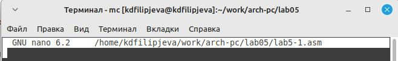{#fig:4 width=100%}
 
  Введем текст из листинга, сохраним изменения и проверим файл на наличие текста программы с помощью клавиши F3. (рис. @fig:5)

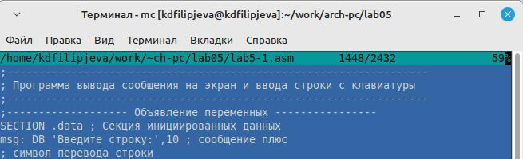{#fig:5 width=100%}

  Оттранслируем файл в объектный, и проверим корректность работы. (рис. @fig:6)

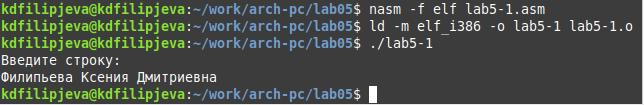{#fig:6 width=100%}

  Предварительно скачав файл "in_out.asm" с ТУИСа добавим его в нашу папку. Так же создадим файл "lab5-2.asm". (рис. @fig:7)

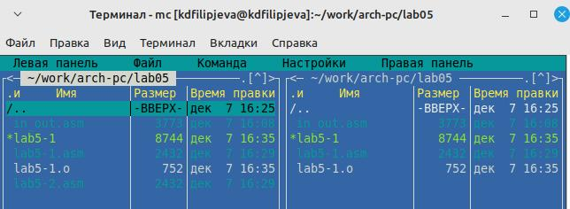{#fig:7 width=100%}

  Исправим текст программы в файле "lab5-2.asm" с использованием команд из файла "in_out.asm". Создадим объектный файл. Из-за изменения команды "sprintLF" на "sprint" наша строка стала выводиться сразу после запроса, а не с новой строки. (рис. @fig:8)

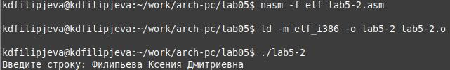{#fig:8 width=100%}

# Выполнение самостоятельной работы
  
  1. Cоздадим копию файла "lab5-1.asm" и внесем изменения, чтобы при вводе текста, программа выводила его повторно. Превратим его в объектный файл. Проверим правильность внесенных изменений. (рис. @fig:9)
  
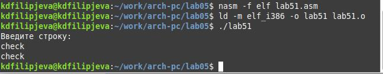{#fig:9 width=100%}
  
  2. Создадим копию файла "lab5-2.asm" и внесем изменения, используя команды из файла "in_out.asm", так, чтобы при вводе текста, программа выводила его повторно. Превратим его в объектный файл и проверим правильность выполнения. (рис. @fig:10)

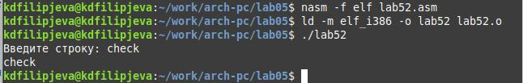{#fig:10 width=100%} 

  3. Скопируем все файлы в локальный репозиторий и выгрузим на Github (рис. @fig:11)

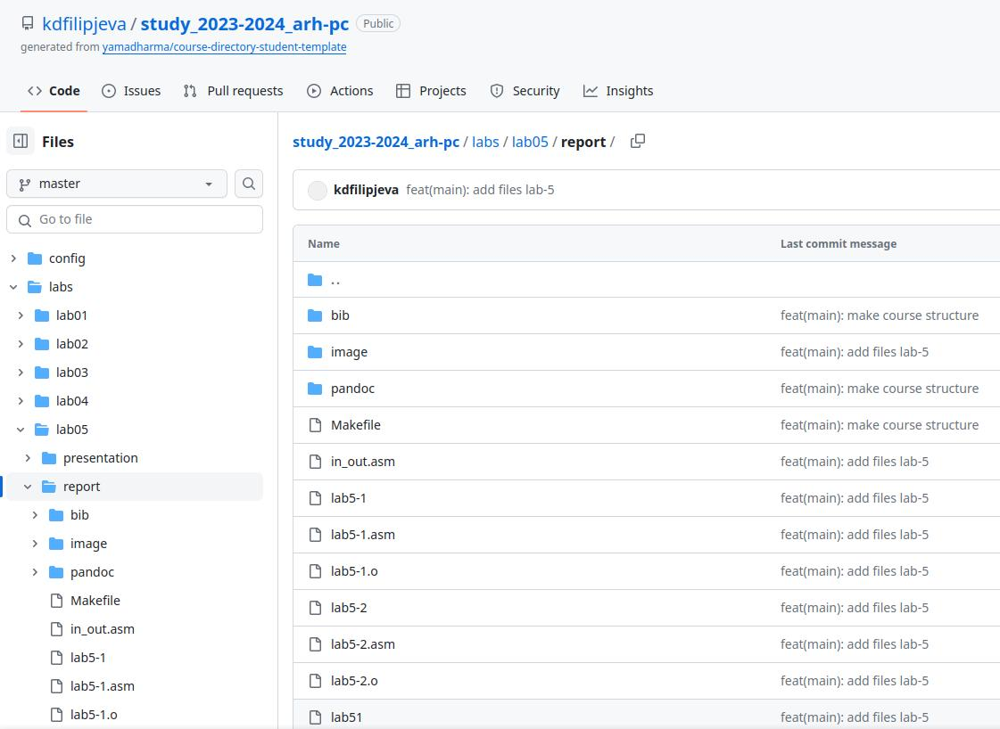{#fig:11 width=100%} 
 
# Выводы

В ходе лабораторной работы мы освоили процедуры компиляции и сборки программ на языке ассемблера.
